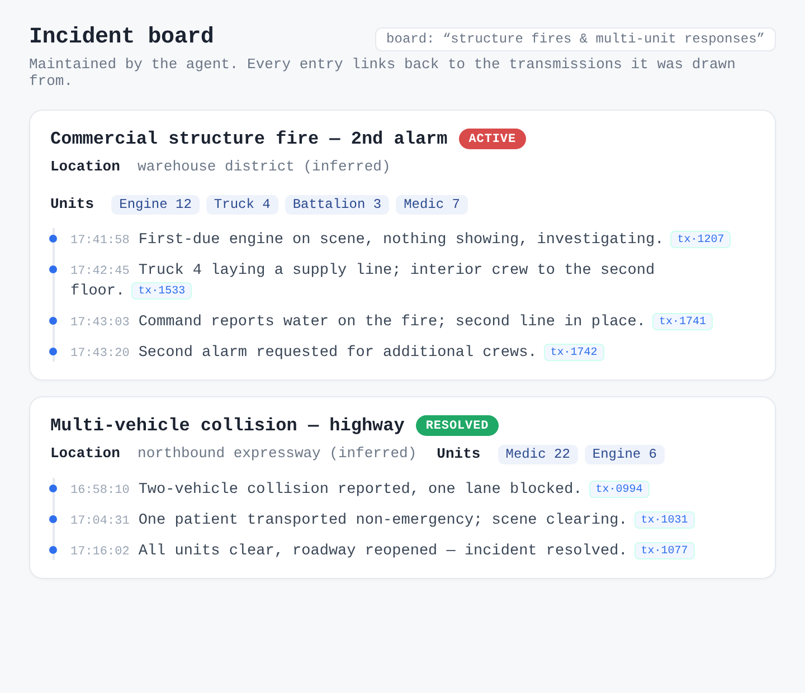
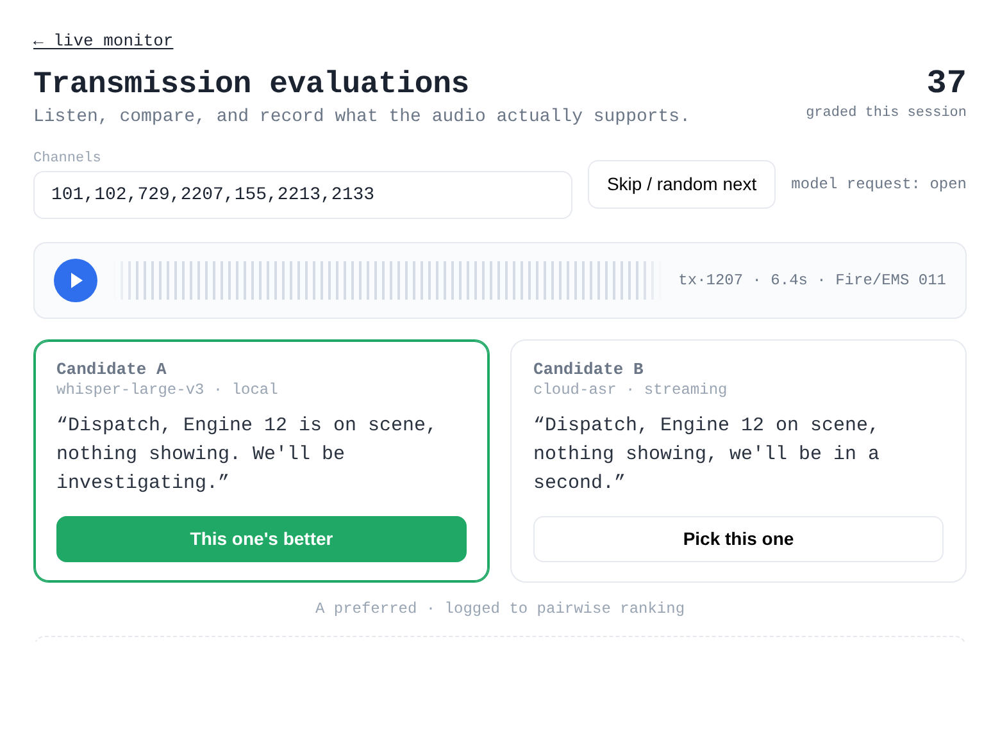

<a class="backlink" href="/#work">← Back to all work</a>

<header class="cs-hero">

Distributed systems · Applied AI

<h1 data-reveal data-delay="1">trunkd</h1>

Public-safety radio is public by law, but you'd never know it — it's audio-only, scattered across dozens of talkgroups, and gone the second it's spoken. trunkd makes it accessible: it listens over software-defined radio, transcribes and categorizes everything with AI, and turns the firehose into a live incident board you can actually watch.

<ul class="tags" data-reveal data-delay="3">
<li>Go</li><li>NATS JetStream</li><li>Kubernetes</li><li>Protobuf</li><li>SQLite / FTS5</li><li>Svelte</li><li>Whisper</li><li>LLM agents</li><li>MCP</li><li>Prometheus</li>
</ul>
</header>

&lt;1sRF capture → browser

~24single-purpose Go services

88versioned Protobuf messages

Soloarchitect, builder &amp; operator

## The problem, and what it does

Problem

Public-safety communications are public, but practically inaccessible to the people who'd benefit from them — partner agencies, journalists, and officials trying to keep up. It's trunked radio (P25, the US digital standard): audio-only, spread across dozens of talkgroups, and gone the moment it's spoken. A scanner lets you <em>listen</em>; it won't let you ask a question, scroll back an hour, or notice that a routine call just became a multi-unit incident.

Solution

Monitor those communications over software-defined radio, use AI models to transcribe and categorize every transmission, then synthesize a live incident board on top — with keyword-based and geofenced alerts so the things you care about find you, instead of the other way around.

The rest of this is how I actually built that — and why I made the calls I did.

## How it's built

The whole thing is **event-sourced**. A single immutable log — the stream of transmission metadata on NATS JetStream — is the source of truth. Everything else is a **disposable projection** I can delete and rebuild by replaying the log. The services are small, single-purpose Go binaries that each subscribe to exactly what they need.

<figure class="panel diagram">
<svg viewBox="0 0 960 500" role="img" aria-labelledby="arch-title">
  <title id="arch-title">trunkd architecture: radio capture flows into a NATS JetStream event log, which fans out to transcription, archival, a search index, an AI incident layer, and the web UI.</title>
  <defs>
    <marker id="arrow" markerWidth="9" markerHeight="9" refX="7" refY="3" orient="auto" markerUnits="userSpaceOnUse">
      <path class="flow-arrow" d="M0,0 L7,3 L0,6 Z"></path>
    </marker>
    <marker id="arrowa" markerWidth="9" markerHeight="9" refX="7" refY="3" orient="auto" markerUnits="userSpaceOnUse">
      <path class="flow-arrow audio" d="M0,0 L7,3 L0,6 Z"></path>
    </marker>
  </defs>

  <text class="grouplabel" x="90" y="26">CAPTURE</text>
  <text class="grouplabel" x="447" y="26">EVENT LOG</text>
  <text class="grouplabel" x="660" y="26">PROJECTIONS &amp; AGENTS</text>

  <path class="flow" marker-end="url(#arrow)" d="M160,244 H190"></path>
  <path class="flow" marker-end="url(#arrow)" d="M336,244 H366"></path>
  <path class="flow audio" marker-end="url(#arrowa)" d="M522,84 H554"></path>
  <path class="flow audio" marker-end="url(#arrowa)" d="M522,168 H554"></path>
  <path class="flow" marker-end="url(#arrow)" d="M760,168 H806"></path>
  <path class="flow" marker-end="url(#arrow)" d="M522,252 H554"></path>
  <path class="flow" marker-end="url(#arrow)" d="M760,252 H806"></path>
  <path class="flow" marker-end="url(#arrow)" d="M522,348 H590"></path>
  <path class="flow" marker-end="url(#arrow)" d="M648,280 V310"></path>
  <path class="flow" marker-end="url(#arrow)" d="M796,348 H806"></path>
  <path class="flow" marker-end="url(#arrow)" d="M575,280 V398"></path>
  <path class="flow audio" marker-end="url(#arrowa)" d="M447,460 C447,478 520,470 554,438"></path>

  <rect class="box" x="20" y="214" width="140" height="60" rx="9"></rect>
  <text class="lbl" x="90" y="240" text-anchor="middle">Radio capture</text>
  <text class="sub" x="90" y="257" text-anchor="middle">trunk-recorder / SDR</text>

  <rect class="box accent" x="196" y="214" width="140" height="60" rx="9"></rect>
  <text class="lbl" x="266" y="240" text-anchor="middle">ingest</text>
  <text class="sub" x="266" y="257" text-anchor="middle">P25 boundaries</text>

  <rect class="box accent" x="372" y="40" width="150" height="420" rx="12"></rect>
  <text class="lbl" x="447" y="216" text-anchor="middle">NATS</text>
  <text class="lbl" x="447" y="234" text-anchor="middle">JetStream</text>
  <text class="sub" x="447" y="254" text-anchor="middle">event log = truth</text>

  <rect class="box" x="554" y="56" width="206" height="56" rx="9"></rect>
  <text class="lbl" x="657" y="80" text-anchor="middle">transcode + transcribe</text>
  <text class="sub" x="657" y="97" text-anchor="middle">PCM → Opus → text</text>

  <rect class="box" x="554" y="140" width="206" height="56" rx="9"></rect>
  <text class="lbl" x="657" y="164" text-anchor="middle">archiver</text>
  <text class="sub" x="657" y="181" text-anchor="middle">mux → object store</text>

  <rect class="box store" x="806" y="140" width="134" height="56" rx="9"></rect>
  <text class="lbl" x="873" y="164" text-anchor="middle">Cloud Storage</text>
  <text class="sub" x="873" y="181" text-anchor="middle">audio archive</text>

  <rect class="box" x="554" y="224" width="206" height="56" rx="9"></rect>
  <text class="lbl" x="657" y="248" text-anchor="middle">index</text>
  <text class="sub" x="657" y="265" text-anchor="middle">search projection</text>

  <rect class="box store" x="806" y="224" width="134" height="56" rx="9"></rect>
  <text class="lbl" x="873" y="248" text-anchor="middle">SQLite + FTS5</text>
  <text class="sub" x="873" y="265" text-anchor="middle">disposable</text>

  <rect class="box accent" x="590" y="310" width="206" height="66" rx="9"></rect>
  <text class="lbl" x="693" y="336" text-anchor="middle">incidentd · summarizer</text>
  <text class="sub" x="693" y="354" text-anchor="middle">LLM tool-loops + MCP</text>

  <rect class="box store" x="806" y="324" width="134" height="48" rx="9"></rect>
  <text class="lbl" x="873" y="352" text-anchor="middle">IRC notify</text>

  <rect class="box accent" x="554" y="398" width="386" height="62" rx="9"></rect>
  <text class="lbl" x="747" y="424" text-anchor="middle">Web UI — Svelte SPA</text>
  <text class="sub" x="747" y="442" text-anchor="middle">live audio + search + incident board</text>

  <line class="flow audio" x1="20" y1="486" x2="48" y2="486"></line>
  <text class="sub" x="54" y="490">audio / live path</text>
  <line class="flow" x1="176" y1="486" x2="204" y2="486"></line>
  <text class="sub" x="210" y="490">events / metadata</text>
</svg>
<figcaption>Radio capture → ingest → NATS JetStream event log → transcription, archival, search index, and the AI incident layer — all read by the Svelte web UI.</figcaption>
</figure>

**How data moves:**

- **ingest** adapts P25 audio from `trunk-recorder`, detects transmission boundaries, and publishes raw PCM plus lifecycle metadata to NATS. Dual ingest pods run active-active and de-duplicate deterministically, so capture never blocks on a slow consumer.
- **transcode / transcribe** convert PCM to Opus and produce streaming transcripts (local Whisper or a cloud model), writing transcript events back to the log. The whole live path is tuned to stay under a second — words appear in the browser in **under one second** from the moment they leave the radio.
- **archiver** muxes finished transmissions into Ogg/Opus and writes them to object storage for indefinite retention.
- **index** projects the metadata stream into SQLite with full-text search — the read API behind the UI. It's intentionally throwaway: delete it and replay the log to rebuild.
- The **Svelte SPA** streams live audio over a WebSocket and queries the index for history; the browser owns all playlist state, so the server stays stateless.

The event log is the source of truth. Everything else — search index, audio archive, incident board, the UI — is a disposable projection you can delete and replay.

## Scale

<!-- TODO(david): confirm hard numbers — transmissions/day, GB/day audio, total archive hours, talkgroups monitored. Happy to add a by-the-numbers strip once you give me figures. -->

trunkd runs continuously, capturing every transmission across dozens of talkgroups at once. Transmissions are short and bursty — a second or two to twenty seconds each — so the system is built for a steady stream of small events rather than big batches:

- **Continuous, never-blocking capture.** Dual active-active ingest pods keep recording even when a downstream consumer stalls; the live path is never allowed to wait on transcription, indexing, or the UI.
- **Sub-second live path.** From RF capture to a transcript rendered in the browser is **under one second**, measured end-to-end (not estimated).
- **Indefinite audio archive.** Every finished transmission is muxed to Ogg/Opus and written to object storage for keeps, so history is fully replayable — the search index and incident board can be thrown away and rebuilt from it at any time.
- **Small, versioned contracts.** ~24 services exchange 88 versioned Protobuf message types over NATS, so the throughput lives in a handful of well-defined streams rather than ad-hoc endpoints.

## The choices I made, and why

Since I'm the only one running this, I kept to a rule: *boring, measurable, one-person-operable*. The hard guarantees live in a few load-bearing decisions, and everything else stays simple.

- **NATS JetStream as the spine.** The live path can never wait on a slow downstream consumer, and I needed dual-ingest to be idempotent without coordinating. JetStream's per-message dedup and durable, replayable streams give me both.
- **Go for every service.** Small binaries I can hold in my head and rewrite from a spec, with CGo where it earns its keep (libopus). Fast to iterate, trivial to deploy.
- **SQLite instead of a database server.** The search index is a projection, not a system of record — it doesn't need durability or HA, it needs to be simple and rebuildable. FTS5 handles the query load, and there's no database for me to babysit.
- **A transmission-centric model.** A "transmission" (one unit keying up once) is the only unit that's reliable across radio technologies. Refusing to guess at "calls" removed a whole class of stale, cross-matched state I'd otherwise have to reconcile.
- **The browser speaks one protocol.** The SPA never learns the storage topology — it subscribes, reads audio, and rebuilds its views client-side. That keeps the server dumb and every view resumable straight from the URL.
- **Contracts versioned from day one.** 88 Protobuf messages on versioned subjects; schema changes are additive, and a breaking change gets a parallel version rather than a migration scramble.

## Letting an LLM run the incident board

The part I'm proudest of is the incident board, and I was deliberate about *not* just throwing prompts at a model. Two long-running services — **incidentd** and **summarizer** — share an agent loop with typed tools and a read-only research surface exposed over **MCP** (Model Context Protocol).

- I configure each **board** in plain English — "multi-alarm fires," "any mass-casualty response." The agent gets the board's criteria, the incidents that are already open, and the recent transcripts that might match.
- Instead of free text, the model proposes changes through a typed `submit_incident_patches` tool. `incidentd` **validates and applies** them — open an incident, move it active → inactive → resolved, append a timeline entry, infer a location. The service is the only writer, so the model can reason all it likes but can never corrupt the state.
- An MCP research surface (`resolve_catalog`, `search_transcripts`, `ask_transmission_audio`) lets the agent look up channel and unit names, search back through history, and cite the specific transmissions it based a decision on.
- **summarizer** writes the periodic shift-report and incident summaries on the same machinery. `ircnotify` relays changes to IRC, and the web UI shows the board live.

The result is a board that opens, annotates, and closes its own incidents — and every entry traces back to the transmissions that justified it, so I can always check its work.

## Making it measure itself

I didn't want to guess whether it was any good, so trunkd measures itself and feeds the results back in:

- **A transcript eval workbench.** A built-in A/B tool lets me listen to two models on the same audio, vote, and type a correction. Those votes compile into pairwise rankings that decide which model I actually run.
- **Adaptive audio gain.** My perceptual ratings (too quiet / comfortable / too loud / noise-limited) plus RMS-dB measurements feed a normalizer, so the automatic gain learns from real judgments instead of a fixed curve.
- **Honest cost and latency numbers.** LLM token usage is metered from the real API responses, never estimated. Latency SLIs measure ingest-to-first-frame and capture-to-audible, sampled only when a browser is sitting idle at the live head so the measurement doesn't lie.
- **Observability from day one.** Every service exposes Prometheus metrics, and the dashboards are a first-class part of the deploy, not an afterthought.

## What was hard

A few problems took real work to get right:

- **Staying under a second without dropping audio.** The live path has to transcribe while never blocking capture. Backpressure anywhere — a slow model, a busy index — can't be allowed to stall the radio, so ingest publishes and moves on, and everything downstream catches up on its own.
- **Idempotent capture with no coordinator.** Two ingest pods record the same radio in parallel for resilience. They de-duplicate deterministically, without a lock or a leader, so one can die mid-transmission and nothing is lost or doubled.
- **Letting a model reason without letting it break things.** An LLM deciding what belongs on an incident board is useful right up until it hallucinates state. Constraining it to typed patches applied by a single authoritative writer — with an evidence trail back to real transmissions — was what made the AI layer trustworthy instead of a liability.
- **Transcribing bad audio.** Radio is clipped, noisy, and wildly inconsistent in level. Getting usable transcripts meant adaptive gain driven by real perceptual ratings and an A/B eval harness to keep the model honest, rather than trusting any one ASR out of the box.

## What it looks like

<figure class="shot wide live-demo">

liveRF capture → transcript on screen&lt; 1&nbsp;second

<ul class="ld-rows">
<li class="ld-row" style="--i:0">17:43:41Fire/EMS · Engine 12On scene, nothing showing, investigating.</li>
<li class="ld-row" style="--i:1">17:43:47FEMS · Truck 4Lay us a supply line off the corner hydrant.</li>
<li class="ld-row" style="--i:2">17:43:52Fire/EMS · Battalion 3Command, we have water on the fire, second line in place.</li>
<li class="ld-row" style="--i:3">17:43:58FEMS · Medic 7Transporting one, non-emergency, to the regional center.</li>
<li class="ld-row" style="--i:4">17:44:03Fire/EMS · Battalion 3Requesting a second alarm for additional crews</li>
</ul>

<figcaption>The live monitor, in motion — each transmission is transcribed and on screen in under a second from the moment it leaves the radio. Searchable, and you can scroll back through history. (Transmissions here are fabricated.)</figcaption>
</figure>

<figure class="shot">

<figcaption>The incident board the agent maintains on its own — status, location, units, and a timeline, with every entry citing the transmission behind it.</figcaption>
</figure>

<figure class="shot">

<figcaption>The eval workbench — two models on the same clip, I pick the better one and fix it if needed, and the votes decide what I run.</figcaption>
</figure>

<em>Transcripts and incidents shown here are fabricated. The real feed carries live public-safety audio, so these are stand-ins that mirror the actual interface without exposing anyone's information.</em>

## Where it stands

trunkd runs in production today — capturing, transcribing, and quietly maintaining its incident board around the clock. I designed, built, and operate all of it myself: the protocol work, the streaming media, the agent loop, the Svelte frontend, the Kubernetes deployment, and the dashboards that tell me when something's off.

It started as a way to answer a small question — *what's going on out there right now?* — and turned into the project where I got to work through event sourcing, LLM agents with real guardrails, and full-stack ownership end to end. It's still the one I keep coming back to.
